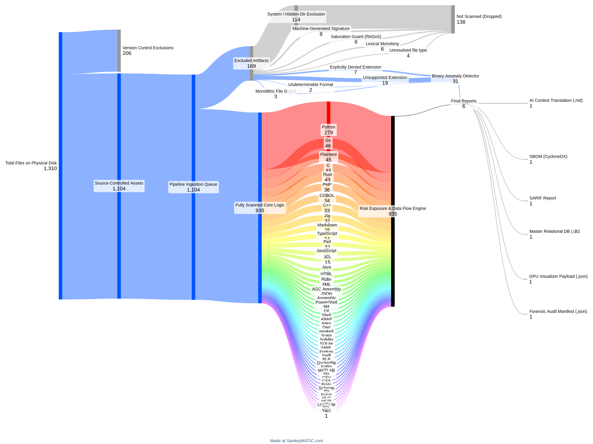

<div align="center">

# GitGalaxy 

[Docs](https://squid-protocol.github.io/gitgalaxy/) · [Visualizer](https://gitgalaxy.io/)

[](https://badge.fury.io/py/gitgalaxy)
[](https://www.python.org/downloads/)
[](https://polyformproject.org/licenses/noncommercial/1.0.0/)
[](#)
[](#)
[](#)

[](https://pypi.org/project/gitgalaxy/)
[](#)

</div>

<div align="center">

**1 scan** · **97 structural signals** · **50+ languages** · **0 need for compilation**<br>
**19 risk exposure scores** · **6 final reports** · **0 dependencies** · `pip install gitgalaxy`

</div>

<div align="center">

Gitgalaxy can assess full repos, comprised of mixes of 50+ different languages and map out the architecture, provide risk exposures and actionable fixes to lower those exposures. The graph below is a workflow from one gitgalaxy scan from on our golden test repo, which contains sample code files from the Apollo-11 1969 flight software through the modern tech stacks. [Benchmark](https://github.com/squid-protocol/language-crucible)   


</div>

<div>

### **Whole-Repository Intelligence with a Unique Security Layer **

Gitgalaxy is a tool to  determistically audit code, fast enough for the CI pipeline. Most code intelligence engines use an AST, like tree-sitter, which is offers an overly granular view of a repos (like asking to understand a house and getting a list of every brick and glass pane) and it limits the languages and files that can be scanned. Modern repos are poly-lingual. Many repos have old code without a good AST. To bypass this, Gitgalaxy uses a custom regex/lexical structural-analysis engine with a statistics layer on top — it builds a feature vector per file (from ~97 regex "signal" categories - that mark the boundaries of functions, control flow, I/O, state mutation, and dozens of other structural and security-relevant behaviors) and per repo (dependency graph via import resolution + PageRank/centrality), then transforms those raw counts into normalized 0–100 risk scores via sigmoid functions, and exports the result to six formats. 

Gitgalaxy trades AST-level precision for orders-of-magnitude speed and universal language coverage, in the same spirit that [BLAST traded Smith-Waterman's](https://squid-protocol.github.io/gitgalaxy/03-01-claim-1-search-strategies/) exhaustive alignment for heuristic speed in genomics. Output includes SARIF, CycloneDX SBOM, a queryable SQLite knowledge graph, an LLM-optimized architecture brief, and 3D visualization data from a single scan pass that takes seconds. 

The result is a deterministic knowledge graph of the repository, built without ever requiring the code to compile. It calculates the ratio of test code to core logic, maps each file's downstream "blast radius" through the dependency graph, and surfaces project-structure signal that line-by-line linters miss entirely. Per-file signal extraction runs in time linear to codebase size; repository-level graph metrics (centrality, community detection) use standard network-analysis algorithms with explicit sampling bounds on very large graphs.

Our unique engine allows for the unique ways to scan for several CWEs families without the need for CVE lists, which is a unique edge for our code intelligence engine. 

</div>

<div>

### Scanning Apollo-11 with the blAST Engine


</div>

<div>

## What GitGalaxy Finds — and What It Doesn't Claim

GitGalaxy produces two different kinds of output, and they should be read differently.

**Risk Exposure scores** are a 0–100, density-normalized signal across 19 categories
(secrets, injection surface, memory corruption, and more), rolled up from function to
file to folder to repository. A high score means *this deserves attention first* — it
is a prioritization signal, not a verdict. Two files can carry the same score for
completely different reasons: a real problem, or a legitimate pattern that looks
identical on the surface. Encrypted malware and a well-tested cryptography routine
both produce high entropy. GitGalaxy can't tell you which one it found — only that
something worth a second look is there.

**Findings** are individual, line-level flags: a specific Structural Signature that
crossed a risk threshold. These are evidence to review, not confirmed vulnerabilities.
GitGalaxy never executes code, traces runtime dataflow, or verifies exploitability —
it tells you a pattern exists in the text, at this exact line, and hands you the
context to judge it yourself.

**This is intentional, not a limitation we're hiding.** GitGalaxy is built to err
toward recall over precision: flag more, and let a human or a deeper tool narrow the
list, rather than risk staying silent on something real. False positives are the
expected cost of that trade-off, the same way they are for every static analyzer that
doesn't execute the code it reads.

That also means GitGalaxy is strongest against a specific class of problem —
**negligence, not adversarial evasion.** A hardcoded key someone forgot to remove, an
insecure registry, an obviously dangerous `eval()` call — nobody on the other end of
those is trying to hide from a scanner. A specifically motivated attacker who knows
how static, signature-based detection works can evade individual signals like entropy
thresholds without much effort. Treat GitGalaxy as the fast first pass across a
codebase too large to read by hand — not the last word on whether something is safe.

</div>

### Weakness Classes, Not Just Known CVEs

Most dependency scanners work from a lookup table: they know a vulnerability exists
because someone found it, filed it, and it now has a CVE number in a feed. That's
useful, but it's necessarily reactive — a scanner built this way is blind to anything
that hasn't been discovered and disclosed yet, including straightforward variants of
known-bad patterns that just look slightly different from the filed instance.

GitGalaxy takes a different approach: instead of matching known instances, it matches
weakness *classes*. Its findings are tagged by CWE (Common Weakness Enumeration) —
hardcoded credentials, dynamic code execution, unsafe deserialization — not by CVE ID.
A structural signature for "dynamic execution of tainted input" catches that pattern
wherever it appears, with whatever variable names, in whatever specific arrangement —
not just the one instance someone already filed a report about.

The same philosophy extends to the SBOM layer. Rather than asking "does this package
version appear in a vulnerability database," GitGalaxy's zero-trust physical audit
asks "does this package's actual content on disk structurally match what a legitimate
version should look like" — entropy, structural fingerprint, behavioral anomaly flags.
That's how a tampered dependency gets caught on day one, before anyone has discovered
or disclosed anything, because there's no CVE to wait for.

This is a complement to CVE-feed tools (Snyk, Dependabot, OSV-Scanner), not a
replacement for them — those tools are the right answer for "is this exact known bug
present." GitGalaxy is the right answer for the wider net: weakness classes and
physical anomalies that don't require anyone to have found and filed the specific
instance first.

### Real-World Adoption

<div align="center">

Tracking the total, deduplicated volume of fetches across PyPI, GitHub, and GitLab against our baseline control repositories.


Measured without mirrors. The GitHub/PyPI breakdown lines begin partway through the window because per-source tracking was added after total-fetch tracking; the total line before that point is aggregate across all sources.
</div>

<div>

## Benchmarks
* **[50+ Language Test Repo](https://github.com/squid-protocol/language-crucible)** and [artifacts](https://github.com/squid-protocol/language-crucible/tree/main/raw_output)
* **[Speed Results from 104 Repos](https://squid-protocol.github.io/gitgalaxy/03-01-claim-1-search-strategies/)**
* **[Cross-Language Comparisons of over 1000 repos](https://squid-protocol.github.io/gitgalaxy/03-04-claim-4-comparing-languages/):** Deterministic 1:1 benchmarking of distinct syntax architectures.
* **[Universal File Archetypes by k-means clustering](https://squid-protocol.github.io/gitgalaxy/03-05-claim-5-file-archetypes/):** ML isolation of files into K-means clusters.
* **[Mainframe Proven: 100% CI/CD Translation Success Rate](https://github.com/squid-protocol/gitgalaxy/tree/main/examples/ibm_cics_translation):** 27 out of 27 successful architectural translation of 27 distinct legacy COBOL repositories (including IBM CICS benchmark apps) into compiling Java Spring Boot environments.

</div>

<div>

## Data Privacy & On-Premise Deployment
* 100% air-gapped execution
* On-premise deployment
* Zero-trust processing model
</div>

<div>

## Installation & Usage
* Python-based: `pip install gitgalaxy`
* CLI execution
* **[How to add a new programming language in 1 prompt](https://github.com/squid-protocol/gitgalaxy/blob/main/gitgalaxy/standards/how_to_add_a_language.md)**
* Outputs forensic JSONs (optimized for AI-agent summary reports) and a native SQLite3 database for robust querying and storage.

### CI/CD Integration

Drop the template for your platform straight into your pipeline — each one runs a GitGalaxy scan and can fail the build on risk-threshold or malware-signature breaches.

| Platform | Template |
|---|---|
| **GitHub Actions** | [`gitgalaxy-pipeline.yml`](https://github.com/squid-protocol/gitgalaxy/blob/main/templates/github/gitgalaxy-pipeline.yml) — see the [full integration guide](https://github.com/squid-protocol/gitgalaxy/blob/main/github-action-readme.md) |
| **GitLab CI** | [`scan.yml`](https://github.com/squid-protocol/gitgalaxy/blob/main/templates/gitlab/scan.yml) |
| **Bitbucket Pipelines** | [`bitbucket-pipelines.yml`](https://github.com/squid-protocol/gitgalaxy/blob/main/templates/bitbucket/bitbucket-pipelines.yml) + [`bitbucket_insights.py`](https://github.com/squid-protocol/gitgalaxy/blob/main/templates/bitbucket/bitbucket_insights.py) (posts findings as Bitbucket Code Insights annotations) |
| **Azure Pipelines** | [`azure-pipelines.yml`](https://github.com/squid-protocol/gitgalaxy/blob/main/templates/azure/azure-pipelines.yml) |
| **Anything else** (Jenkins, CircleCI, etc.) | [`scan.yml`](https://github.com/squid-protocol/gitgalaxy/blob/main/templates/scan.yml) — generic, shell-invocable template |

</div>


## Enterprise Codebase Tools & Use Cases

GitGalaxy operates on a Decoupled Architecture. While the core engine provides the overarching structural mechanics and topological mapping, our specialized Decoupled Execution Controllers leverage that deterministic graph to execute enterprise-grade operations.

### [Automated Legacy Migration: COBOL to Java Spring Boot](https://github.com/squid-protocol/gitgalaxy/tree/main/gitgalaxy/tools/cobol_to_java/)
A deterministic, high-fidelity translation pipeline. It converts legacy COBOL into fully compiling, modern Spring Boot architectures, mapping memory exactly and scaffolding JPA entities, REST controllers, and Maven builds before utilizing AI to translate isolated business logic.
* **Proven Metric:** Achieved a perfect 27/27 Maven compile success rate across a batch test of distinct legacy repos.
* **Verify for Yourself:** [Inspect the raw outputs of the IBM CICS Application Translation here.](https://github.com/squid-protocol/gitgalaxy/tree/main/examples/ibm_cics_translation/)

### [Mainframe Refactoring: COBOL & JCL Optimization](https://github.com/squid-protocol/gitgalaxy/tree/main/gitgalaxy/tools/cobol_to_cobol/)
An analytical suite for sanitizing mainframe monoliths. It safely neutralizes legacy lexical traps, extracts dead execution memory, maps topological DAG execution orders, and generates Zero-Trust JCL configurations for modern cloud deployments.
* **Proven Metric:** The dead-code extraction engine removed over 6,700 lines of dead execution blocks and orphaned variables from the standard IBM CICS benchmark app in seconds.

### [Software Supply Chain Security & Pre-Commit Firewalls](https://github.com/squid-protocol/gitgalaxy/tree/main/gitgalaxy/tools/supply_chain_security/)
Extreme-velocity pre-commit firewalls. Instead of trusting manifest files, it scans physical internals to block steganography, byte-level XOR decryption loops, homoglyph typosquatting, and exposed cryptographic vaults before they ever enter your CI/CD pipeline. **[Deploy directly via our GitHub Action](https://github.com/squid-protocol/gitgalaxy/blob/main/github-action-readme.md).**

### [Zero-Trust SBOM Generation & Dependency Auditing](https://github.com/squid-protocol/gitgalaxy/tree/main/gitgalaxy/tools/compliance/)
A Zero-Trust Software Bill of Materials (SBOM) generator. It refuses to blindly trust `package.json` or `requirements.txt` files, instead locating the physical dependencies on disk, mathematically verifying their entropy and linguistic identity, and generating strict CycloneDX 1.4 JSON reports.
* **Proven Metric:** Successfully mapped and mathematically verified the physical internals of 170 unique Go modules inside the local Kubernetes repository.

### [API Security & Shadow API Detection](https://github.com/squid-protocol/gitgalaxy/tree/main/gitgalaxy/tools/network_auditing/)
A deterministic mapping tool that hunts undocumented vulnerabilities. It uses structural regex to find active physical routing logic (Express, Spring Boot, FastAPI) and applies set theory against official OpenAPI/Swagger documentation to isolate critical Shadow APIs and outdated Ghost APIs.

### [High-Speed PII Detection & Log Analysis](https://github.com/squid-protocol/gitgalaxy/tree/main/gitgalaxy/tools/terabyte_log_scanning/)
Unindexed, tactical log analysis operating at 0.07 GB/sec. It streams massive database dumps to deterministically hunt and mask PII (Credit Cards, SSNs, AWS Keys) and uses static architecture maps to prove exact runtime execution frequencies with ASCII time-series histograms.

### [AI Agent Guardrails & Codebase Protection](https://github.com/squid-protocol/gitgalaxy/tree/main/gitgalaxy/tools/ai_guardrails/)
Specialized keyword sensors protecting both your application and your codebase. The AppSec Sensor detects weaponized LLM features (RCE funnels, exfiltration risks), while the Dev Agent Firewall evaluates token mass and blast radius to restrict autonomous coding agents from modifying dangerous or context-token-draining files. Helps identify which files need to be chunked to reduce context overload.

## Local Browser-Based 3D Codebase Visualization

If you prefer visual analytics, we've built a topological dashboard where each file represents a node, sized and colored according to specific risk metrics.

Simply drag and drop your generated `your_repo_GPU_galaxy.json` file (or a `.zip` of your raw repository) directly into [GitGalaxy.io](https://gitgalaxy.io/). All rendering and scanning happens entirely in your browser's local memory.

### 🔭 Watch GitGalaxy in Action

**Mapping 3.2 Million Lines of C++ in 11 Seconds | OpenCV** [](https://youtu.be/3ScQCSUBdZw)


## Zero-Trust Data Security

Your code never leaves your machine. GitGalaxy performs 100% of its scanning and vectorization locally.

* **No Data Transmission:** Source code is never transmitted to any API, cloud database, or third-party service.
* **Ephemeral Memory Processing:** Repositories are unpacked into a volatile memory buffer (RAM) and are automatically purged when the browser tab is closed.
* **Privacy-by-Design:** Even when using the web-based viewer, the data remains behind the user's firewall at all times.

## ⚖️ Licensing & Usage

Copyright (c) 2026 Joe Esquibel

GitGalaxy is distributed under the **PolyForm Noncommercial License 1.0.0**. 

### 🎓 Community Free Tier (Academic, Research, & Hobbyist)
We are deeply committed to the open-source and academic communities. If you are using GitGalaxy for personal projects, academic research, or non-commercial development, the engine is 100% free to use.

To suppress the commercial licensing delays in your terminal or personal CI/CD pipelines, simply set the following environment variable:

```bash
export GITGALAXY_LICENSE_KEY="COMMUNITY_FREE_TIER"
```

### 🏢 Commercial & Enterprise Use
Running GitGalaxy in corporate environments, proprietary codebases, or commercial CI/CD pipelines requires an enterprise license. Unlicensed corporate pipelines will experience intentional execution friction, and attempting to use the Community Free Tier key in a corporate environment will trigger explicit non-compliance warnings in your audit logs.

To acquire a zero-trust commercial key for your organization and ensure clean compliance logs, please contact: **joe@gitgalaxy.io**