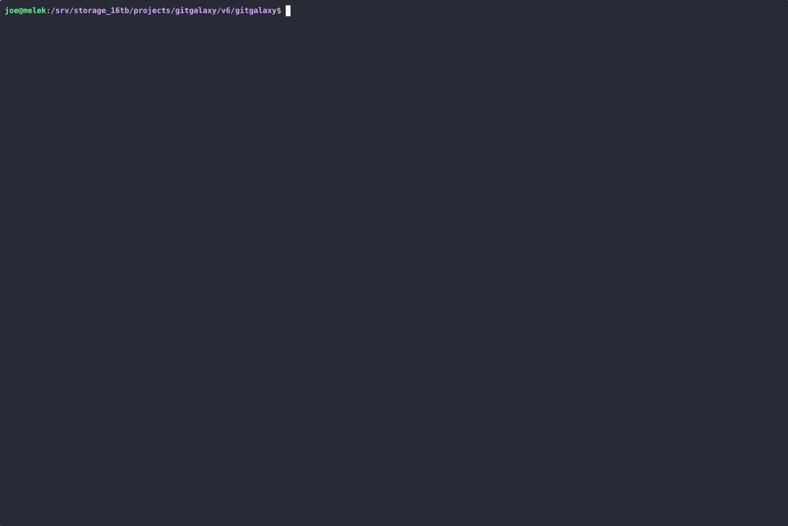

# GitGalaxy: API Security & Shadow API Detection

[](#)
[](#)
[](#)

Welcome to the **GitGalaxy API Security & Attack Surface Mapping Suite**.

Security documentation is often strictly theoretical, whereas compiled source code represents physical reality. Attackers do not exploit the APIs you have documented; they hunt for the forgotten, undocumented endpoints left exposed in your codebase.

Standard DevSecOps scanners rely on approved Swagger or OpenAPI files to dictate what should be tested. GitGalaxy provides a deterministic source of truth. By scanning the raw codebase at high velocity, we reveal the exact routing logic that is actively exposed to the network, regardless of what the documentation claims.

### 🔍 Core Methodology: OpenAPI Drift Detection

We utilize AST-free stoichiometric signatures—calculated metrics derived directly from DNA/regex hits—to bypass theoretical documentation and map physical routing logic at extreme velocity.

* **Map Physical Reality:** Scans raw text for actual execution routes without needing a compiler or build environment.
* **Extract Theoretical Truth:** Parses official Swagger or OpenAPI specifications.
* **Mathematical Resolution:** Applies strict set theory to expose critical security gaps and API drift.
* **Identify Shadow APIs (Critical Risk):** Exposes undocumented, active endpoints that evade standard WAFs and security audits.
* **Identify Ghost/Zombie APIs (Audit Bloat):** Highlights documented but non-existent or deprecated endpoints.

### 🧠 Smart Auto-Discovery & Monorepo Support

You don't need to manually feed specification files to the engine. GitGalaxy features intelligent target acquisition:
* **Signature Grepping:** Recursively hunts and deep-scans files for OpenAPI/Swagger structural signatures.
* **Test-Pollution Bypassing:** Automatically isolates and ignores specification files hidden inside `test/` or `__tests__/` directories.
* **Microservice Unioning:** Use the `--merge-all` flag to automatically stitch together multiple discovered Swagger files in a monorepo into a single unified truth state.

### 🛡️ Field-Tested at Scale: The tRPC Audit
To prove this engine operates at enterprise scale, we field-tested it against **tRPC**, a massive, highly complex TypeScript monorepo. 

Standard tools would choke on the nested monorepo architecture or require complex AST setups. GitGalaxy bypassed the noise, mapped the physical endpoints, and immediately identified an undocumented `GET /` Shadow API living in a `server.ts` file, while simultaneously flagging three documented endpoints that didn't actually exist in the physical code.



### ⚙️ Supported Frameworks

Our AST-free regex signatures deterministically map open APIs across multiple languages natively:

* **Node.js:** Express, Fastify, and Koa (`app.post`)
* **Python:** FastAPI, Flask, and Django (`@app.get`)
* **Java:** Spring Boot (`@GetMapping`)
* **Golang:** Gorilla Mux, Gin, Fiber (`.HandleFunc`)
* **C# (.NET):** Controllers and Minimal APIs (`[HttpGet]`, `.MapGet`)
* **Rust:** Actix and Rocket (`#[get]`)
* **PHP:** Laravel and Symfony (`Route::get`)
* **Ruby:** Rails and Sinatra

---

### 🚀 Quickstart: Local CLI & CI/CD Integration

If you have installed GitGalaxy globally via PyPI (`pip install gitgalaxy`), the API mapper is available directly in your terminal. It executes in seconds, making it ideal for both local checks and automated pipelines.

#### 1. Local CLI Execution

Execute the tool directly against your physical source code. The engine will auto-discover your Swagger file and generate an immediate gap analysis:

```bash
api-network-map /path/to/source/code
```

*(Optional) Target a specific specification file directly:*
```bash
api-network-map /path/to/source/code --swagger /path/to/swagger.json
```

*(Optional) Merge all discovered Swagger files in a microservice monorepo:*
```bash
api-network-map /path/to/source/code --merge-all
```

#### 2. GitHub Actions CI/CD Integration

You can automatically audit your API surface area on every Pull Request to ensure developers aren't silently exposing new endpoints without updating the Swagger documentation.

Create `.github/workflows/api-audit.yml`:

```yaml
name: Shadow API Audit

on:
  pull_request:
    branches: [ "main" ]

jobs:
  gitgalaxy-api-scan:
    runs-on: ubuntu-latest
    steps:
      - name: Checkout Repository
        uses: actions/checkout@v4

      - name: Run Shadow API Hunter
        uses: squid-protocol/gitgalaxy@main
        with:
          tool: 'api-network-map'
          target: '.'
          # Optional: Add extra arguments if you have multiple Swagger files
          # args: '--merge-all'
```

---

### 📊 The Audit Dashboard
Outputs a deterministic terminal dashboard optimized for CI/CD pipeline integration and security team review.

* **Shadow APIs Detected:** Lists physical files containing hidden, undocumented routers.
* **Ghost APIs Detected:** Lists missing routes to eliminate security team audit bloat.

---
### 🌌 Powered by the blAST Engine (Bypassing LLMs and ASTs)
This tool is a modular enterprise integration within the broader GitGalaxy architecture. It is driven by our custom mathematical heuristics engine, capable of mapping multi-dimensional relationships at extreme velocity. Read the official documentation to see how we deterministically map API routes:

* 📖 **[Full API Network Map Architecture](../../../docs/wiki/04-01-full-api-network-map.md)**
* 📖 **[The Network Risk Sensor Mechanics](../../../docs/wiki/02-16-network-risk-sensor.md)**
* 📖 **[API Exposure Risk Equations](../../../docs/wiki/08-14-api-exposure.md)**
* 🪐 **[Return to the Main GitGalaxy Hub](https://github.com/squid-protocol/gitgalaxy)**