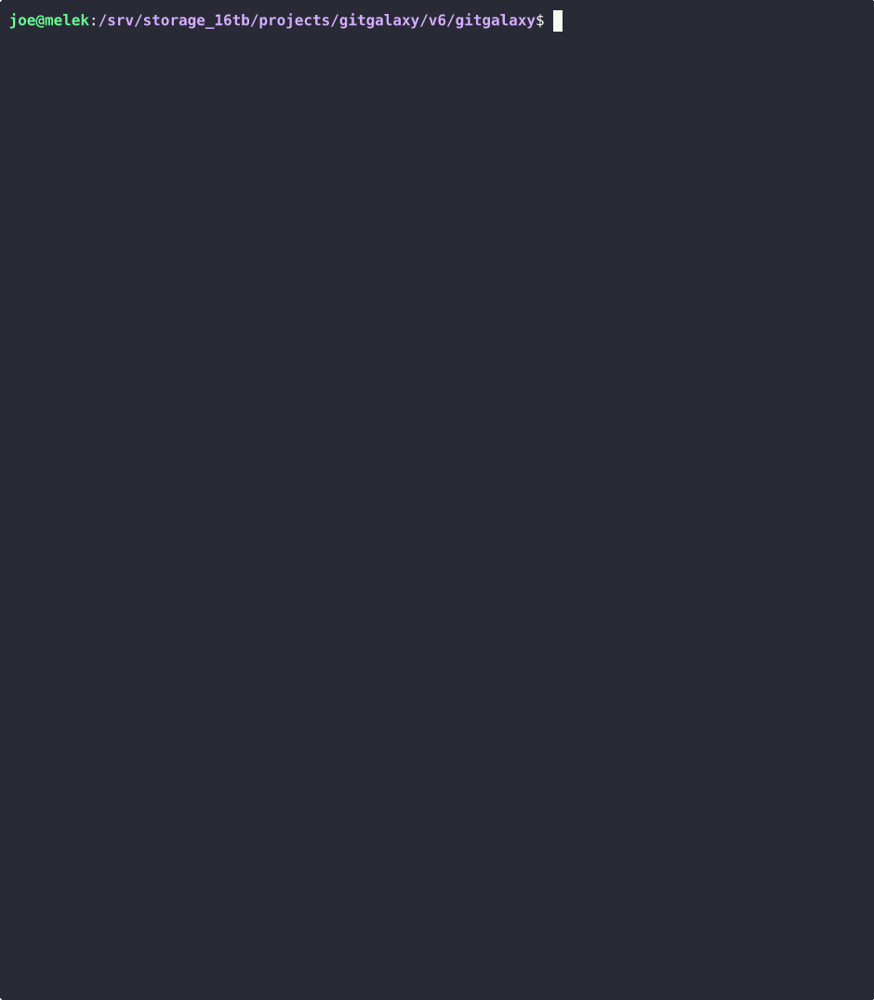

# GitGalaxy: Supply Chain Security & Pre-Commit Sentinels

[](#)
[](#)
[](#)

Welcome to the **GitGalaxy Supply Chain Security Suite**.

Standard security scanners have a massive blind spot: they read your `package.json` or `requirements.txt` and check those names against CVE databases. They never look inside the actual downloaded files. 

Modern attackers (like the **XZ-Utils** or **Glassworm** campaigns) exploit this. They don't announce themselves in a manifest.

GitGalaxy operates differently. We scan the physical internals of every dependency file at extreme velocities (100k+ LOC/sec) before it enters your system. 

### 🛡️ What We Stop
We provide highly effective defense against structural threats:
* **Hidden Executables:** Steganography and XZ-Utils attack patterns.
* **Malicious Typosquatting:** Unicode homoglyphs tricking developer imports.
* **Encrypted Payloads:** Sub-atomic XOR decryption loops.
* **Hostile I/O:** Shadow imports establishing covert outbound connections.
* **Anomalous Logic:** Network sockets hidden inside declarative CSS/JSON.

---

### 🛠️ The Sentinel Tools

Wired directly into your Git Pre-Commit hooks or CI/CD pipelines, these sentinels act as a physical firewall to fail poisoned builds early.

#### 1. The Supply Chain Firewall (`supply-chain-firewall`)
Scans massive `node_modules` or `venv` directories in seconds.
* **Zero-Trust Verification:** Checks every physical `import` against allowlists.
* **Behavioral Heuristics:** Scans for tainted data injection routines.

#### 2. X-Ray Inspector (`xray-inspector`)
Designed to triage binary files and encrypted malware.
* **Magic Byte Validation:** Catches executable scripts disguised as images.
* **Entropy Math:** Flags high-entropy encrypted text payloads.
* **Parasitic Headers:** Detects executable logic inside static data blobs.

#### 3. Vault Sentinel (`vault-sentinel`)
A hyper-speed pre-commit hook strictly for secret detection.
* **Tier 0 Path Blocking:** Instantly blocks sensitive file path commits.
* **Deep Content Scanning:** Hunts for hardcoded cloud cryptographic keys.
* **Graveyard Detection:** Finds abandoned passwords in commented code.

---

### ⚡ Performance Showcases

#### Showcase A: Vault Sentinel (Secret Detection)
To prove this engine operates fast enough to be a synchronous pre-commit hook without frustrating developers, we unleashed the **Vault Sentinel** on the massive **tRPC** TypeScript monorepo. 

The engine evaluated 871 files and performed deep-content cryptographic scans on 695 of them in **0.53 seconds** (processing over 1,300 files per second). It successfully intercepted 7 exposed environment/config files and caught a hardcoded API key before the commit could execute.



#### Showcase B: X-Ray Inspector (Malware & Binary Triage)
To test binary detection, we ran the **X-Ray Inspector** against **pwntools**, an exploit development framework containing actual compiled binaries and shellcode.

The engine ripped through the repository at **2,825 files per second**. By reading the raw physical bytes rather than trusting file extensions, it instantly detected 13 parasitic `ELF` execution headers embedded inside the source tree.


```text
🔎 Scanning 95 files for structural anomalies:
   - Magic Byte Mismatches (e.g., hidden executables disguised as images)
   - Parasitic Execution Headers (e.g., executable logic buried in data blobs)
   - High-Entropy Encrypted Payloads (e.g., packed malware or sub-atomic XOR loops)
☢️  [ANOMALY DETECTED] examples/fmtstr/printf.mipsel
   -> Embedded execution header found: b'\x7fELF'
☢️  [ANOMALY DETECTED] examples/fmtstr/printf.mips64el
   -> Embedded execution header found: b'\x7fELF'

===========================================================================
 ☢️  X-RAY INSPECTOR: MISSION REPORT
===========================================================================
 Files Evaluated    : 95
 Files Deep Scanned : 95
 Time Elapsed       : 0.03 seconds
 Scan Velocity      : 2,825 files/sec
---------------------------------------------------------------------------
 Active Anomalies   : 13
 File Denylist Blocks : 0
 File Allowlist Bypasses: 0
---------------------------------------------------------------------------
 ❌ TRIAGE ALERT: 13 structural anomalies detected. Blocking commit/PR.
```

#### Showcase C: Supply Chain Firewall (Infrastructure-as-Code Audit)
To prove the firewall can handle diverse ecosystems without throwing false positives, we ran it against the **Terraform** repository. 

The engine parsed 1,834 files at a velocity of **436 files per second**. It successfully verified the integrity of the dependency tree, identified 54 unknown packages for audit, and cleared the build without tripping any false alarms on standard Go/HCL syntax.


```text
🔎 Scanning 1,834 files for supply chain risks:
   - Zero-Trust Package Verification
   - Unicode Homoglyphs & Typo-squatting
   - Steganography & Shadow Imports
   - Tainted I/O & Malicious Execution

===========================================================================
 🧱 SUPPLY CHAIN FIREWALL: MISSION REPORT
===========================================================================
 Mode               : Audit (Allow Whitelist + Unknown, Exclude Blacklist)
 Files Deep Scanned : 1,834
 Scan Velocity      : 436 files/sec
---------------------------------------------------------------------------
 Approved Packages    : 0
 Banned Packages      : 0
 Unknown Packages     : 54
---------------------------------------------------------------------------
 Active Threats       : 0
 File Denylist Blocks : 0
 File Allowlist Bypasses: 0
---------------------------------------------------------------------------
 ✅ BUILD PASSED: Dependency supply chain is clean.
```

---

### 🚀 Quickstart: CI/CD & Pre-Commit Integration

If you have installed GitGalaxy globally via PyPI (`pip install gitgalaxy`), you can execute these Sentinels directly from the terminal or wire them into your automation pipelines.

#### 1. Local CLI Execution
```bash
supply-chain-firewall ./node_modules/
xray-inspector ./src/
vault-sentinel .
```

#### 2. Local Pre-Commit Hook Integration
To run the Vault Sentinel automatically before every commit, add this to your `.pre-commit-config.yaml` file:

```yaml
repos:
  - repo: local
    hooks:
      - id: gitgalaxy-vault-sentinel
        name: GitGalaxy Vault Sentinel
        entry: vault-sentinel
        language: system
        types: [text]
        pass_filenames: true
```

#### 3. GitHub Actions CI/CD Integration
To run the Supply Chain Firewall on every Pull Request, create a `.github/workflows/security.yml` file:

```yaml
name: GitGalaxy Security Audit

on:
  pull_request:
    branches: [ "main" ]

jobs:
  gitgalaxy-scan:
    runs-on: ubuntu-latest
    steps:
      - name: Checkout Repository
        uses: actions/checkout@v4

      - name: Run Supply Chain Firewall
        uses: squid-protocol/gitgalaxy@main
        with:
          tool: 'supply-chain-firewall'
          target: '.'
```

---
### 🌌 Powered by the blAST Engine (Bypassing LLMs and ASTs)
This tool is a specialized spoke in the larger GitGalaxy ecosystem. It is driven by our custom mathematical heuristics engine, capable of mapping multi-dimensional relationships at extreme velocity. Explore the official wiki to see the sub-atomic heuristics used to catch obfuscated malware:

* 📖 **[Supply Chain Firewall Architecture](../../../docs/wiki/04-03-supply-chain-firewall.md)**
* 📖 **[Binary Anomaly & Entropy Mathematics](../../../docs/wiki/04-05-binary-anomaly-detector.md)**
* 📖 **[Hardcoded Secrets Exposure Equations](../../../docs/wiki/08-23-hardcoded-secrets-exposure.md)**
* 🪐 **[Return to the Main GitGalaxy Hub](https://github.com/squid-protocol/gitgalaxy)**