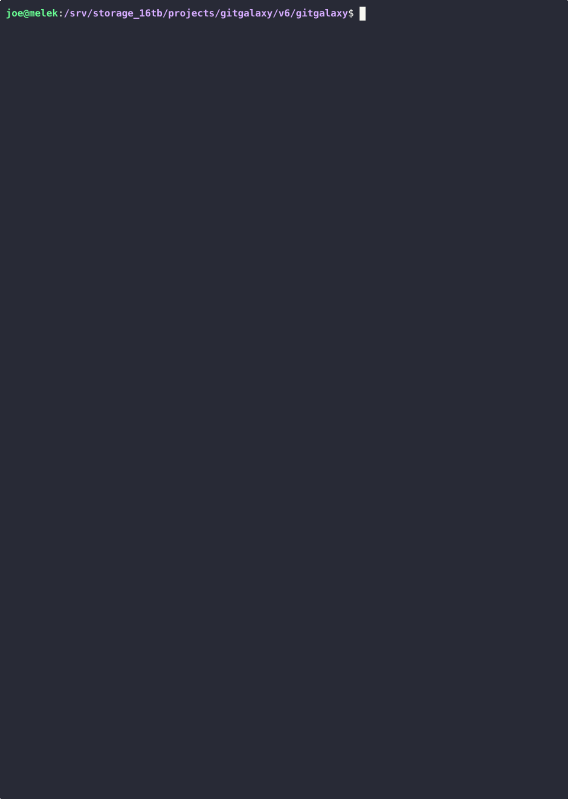
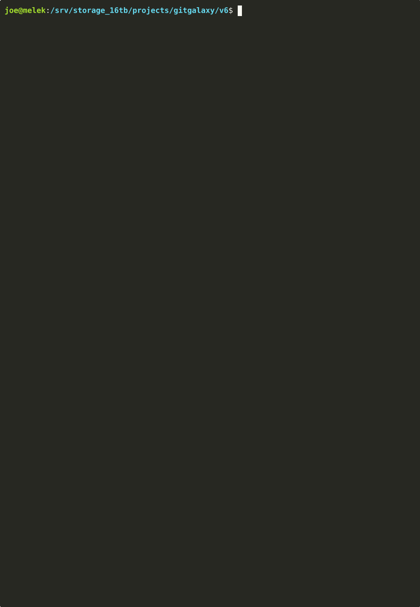

# GitGalaxy Mainframe: Structural Extraction & Legacy Modernization Suite

[-000000.svg?style=flat&logo=ibm)](#)

Welcome to the **GitGalaxy Mainframe Modernization Suite**. This directory contains the deterministic, high-speed static analysis tools required to safely slice, sanitize, and map monolithic legacy architectures prior to cloud migration.

**Mainframe Proven:** The architectural scaffolding generated by these tools compiles natively against raw MVS 3.8j operating systems (1974 Hercules Mainframe), while simultaneously generating strict architectural contracts for modern cloud environments (Spring Boot, PostgreSQL).

## The Why: Bridging the Mainframe-to-Cloud Divide

Enterprise mainframe migrations frequently stall because Cloud Architects and COBOL Engineers speak different architectural languages. Cloud environments rely on dynamic scaling, relational databases, and event-driven Directed Acyclic Graphs (DAGs). Mainframes rely on sequential Job Control Language (JCL), absolute memory boundaries (`REDEFINES`), and proprietary hardware data encodings (`EBCDIC`, `COMP-3`).

**The Generative AI Trap:** Feeding raw, multi-million-line COBOL monoliths into a Large Language Model (LLM) is a guaranteed failure. AI models cannot securely interpret implicit JCL execution orders, they hallucinate dependencies inside unreachable "dead code" paragraphs, and they lack the mathematical context to safely unpack binary `COMP-3` datasets.

**The GitGalaxy Solution:** Before any AI translation or modern scaffolding occurs, we must deterministically map the physical reality of the mainframe. This suite parses the structural intent of the COBOL, strips away decades of dead code rot, extracts the exact I/O data lineage, and translates mainframe binary datasets into cloud-native formats—entirely without compiling Abstract Syntax Trees (ASTs).

---

## The How: Deterministic Extraction & Cleansing

We treat the legacy codebase as a mathematical topology. By utilizing our **Structural Signature Analysis Engine**, we isolate and untangle the monolith through a multi-phase pipeline:

1. **Deprecated Trail Pruning:** We map memory declarations (`DATA DIVISION`) against actual execution calls (`PROCEDURE DIVISION`) to mathematically prove which variables and paragraphs are dead. We mask these out to prevent modern systems from inheriting legacy bloat.
2. **Data Lineage Mapping (DAGs):** By tracking `SELECT/ASSIGN` and `OPEN` statements, we map the exact physical datasets required by each program, generating a strict execution topology that replaces the need for legacy JCL.
3. **Microservice Slicing:** We use recursive data-flow taint tracking to trace a single business variable through `MOVE`, `ADD`, and `COMPUTE` statements. This isolates specific business rules so they can be securely assigned to AI agents for translation, strictly bounding their context windows.
4. **Memory Exhaustion Protection:** The engine dynamically scales between high-speed RAM and disk-backed SQLite to process massive, monolithic legacy repositories without triggering Out-Of-Memory (OOM) crashes.

---

## The What: Core Modules & Tooling

### 1. Architectural Mapping & Triage
* **`cobol_dag_architect.py` (Data Lineage Architect):** Parses COBOL structural intent to map `INPUT/OUTPUT` data flows, calculating the deterministic topological execution order (DAG) required for modern orchestration (e.g., Spring Batch, Airflow).
   
* **`cobol_graveyard_finder.py` (Deprecated Trails Analyzer):** Performs static analysis to isolate unused memory declarations and mathematically unreachable execution logic, preventing the migration of dead weight.
   
* **`cobol_microservice_slicer.py` (Microservice Logic Extractor):** Executes 3-pass recursive variable taint-tracking for safe, isolated business logic extraction.
   

### 2. Data & Schema Modernization
* **`cobol_schema_forge.py` (Cloud Schema Generator):** Translates complex legacy byte-maps (`PIC` constraints) and memory overlays (`REDEFINES`) into strict PostgreSQL DDL schemas.
   
* **`cobol_etl_unpacker.py` (ETL EBCDIC Unpacker):** Translates binary EBCDIC mainframe datasets into modern UTF-8 CSVs, decoding Zoned Decimals and unpacking `COMP-3` nibbles directly into floating-point numerics natively in Python.

### 3. Zero-Trust Infrastructure
* **`cobol_jcl_forge.py` (Zero-Trust JCL Generator):** Auto-generates strict, least-privilege JCL emulators—automatically stripping over-permissioned global access (e.g., `DISP=SHR`) and locking physical dataset provisioning to exact lineage bounds.
   
* **`cobol_jcl_auditor.py` (Zero-Trust JCL Auditor):** Mathematically compares original legacy JCLs against the generated equivalents to quantify architectural bloat reduction and over-permissioned I/O shedding.
* **`cobol_compiler_forge.py` (Mainframe Compiler Generator):** Flattens copybooks and dynamically generates era-aware build JCLs by routing the build sequence to the correct enterprise compiler (COBOL-74 vs COBOL-85).
   

### 4. Code Integrity & Pre-Processing
* **`cobol_lexical_patcher.py` (Lexical Patcher):** Safely neutralizes legacy compiler traps (e.g., converting `NEXT SENTENCE` to explicit `CONTINUE` block scopes) to restore deterministic topological mapping without breaking strict compiler compliance.
* **`cobol_system_limits_reporter.py` (Architectural Anomaly Detector):** Flags non-deterministic routing logic (e.g., `ALTER`, `EXEC CICS HANDLE CONDITION`) that compromises static data lineage.
   
* **`cobol_agent_task_forge.py` (Autonomous Agent Task Generator):** Converts architectural anomalies and extracted dependencies into highly constrained, structured JSON task tickets designed to safely bound LLM agents during code remediation.

---

## 🧠 Engineering Highlights (Architectural Defenses)

* **Unreachable Logic Masking (`cobol_dag_architect.py`):** COBOL programs often contain legacy, unreachable paragraphs. If a standard regex engine scans these, it will extract `OPEN` statements for files that are never actually utilized at runtime, creating false dependencies. We dynamically integrate with the Deprecated Trails Analyzer's state to "mask out" dead paragraphs with whitespace, preserving exact topology while eliminating hallucinated I/O dependencies.
* **Cyclic Copybook Shields (`cobol_compiler_forge.py`):** Legacy architectures frequently contain cyclic dependencies (e.g., Copybook A imports Copybook B, which imports Copybook A). To prevent our in-memory expansion from trapping the CPU in an infinite loop and triggering an OOM crash, we enforce strict, deterministic recursion depth limits during copybook flattening.
* **Defensive COMP-3 Unpacking (`cobol_etl_unpacker.py`):** Packed decimal (`COMP-3`) stores two digits per byte, plus one half-byte (nibble) for the sign. The parser mathematically validates the hex-boundaries (verifying the high nibble is `0-9` and the sign nibble is `A-F`). This intercepts corrupted mainframe memory segments before they crash the Python ETL pipeline.
* **Dynamic Aliasing Resolution (`cobol_graveyard_finder.py`):** COBOL's `REPLACING` clause allows dynamic text substitution at compile time. When hunting for unused variables, the analyzer simulates this substitution in its in-memory buffer using safe, negative lookarounds. This prevents the system from accidentally flagging heavily aliased variables as "dead code."

---

## ⚡ Performance Showcases (Live CLI Execution)

#### Showcase A: Deprecated Trails Analyzer (Graveyard Finder)
Identifying and shedding dead weight prior to a cloud migration saves massive amounts of translation cost and future cloud compute.

~~~bash
python3 cobol_graveyard_finder.py /legacy_corpus/accounting
~~~

~~~text
==========================================================
 📉 DEPRECATED TRAILS REDUCTION REPORT
==========================================================
 Files Flagged for Cleanup : 14
 Unused Memory Addresses   : 142 variables
 Unreachable Logic Blocks  : 37 paragraphs
 ✂️ Estimated Bloat Removed : ~1,790 Lines of Code
==========================================================
~~~

#### Showcase B: Data Lineage Architect (DAG Generation)
Automatically generating the correct execution order by mapping physical dataset dependencies (Inputs vs. Outputs) across multiple monolithic programs.

~~~bash
python3 cobol_dag_architect.py /legacy_corpus/nightly_batch
~~~

~~~text
==========================================================
 ⚡ DETERMINISTIC EXECUTION PIPELINE (TOPOLOGICAL SORT)
==========================================================

 STEP 01: Run [ACCT-INIT]
          ↳ Reads : SYS-CONFIG-FILE
          ↳ Writes: DAILY-LEDGER-DB
----------------------------------------------------------
 STEP 02: Run [LEDGER-CALC]
          ↳ Reads : DAILY-LEDGER-DB, RATES-TBL
          ↳ Writes: PROCESSED-LEDGER-DB
----------------------------------------------------------
 STEP 03: Run [REPORT-GEN]
          ↳ Reads : PROCESSED-LEDGER-DB
          ↳ Writes: FINAL-REPORT-OUT
----------------------------------------------------------
~~~

#### Showcase C: Master Orchestration (CICS Banking Application)
Below is the live console output of the central orchestrator processing a legacy IBM CICS banking application. Notice the engine identifying over 6,700 lines of dead code, warning about macro substitutions, and automatically routing the compiler based on the detected COBOL dialect (74 vs 85).

~~~text
=== 1. INITIATING DEPRECATED TRAILS ANALYZER ===
🔍 GitGalaxy Deprecated Trails Analyzer scanning cics-banking-sample-application-cbsa for obsolete logic...
[... File Scans Omitted for Brevity ...]
==========================================================
 📉 DEPRECATED TRAILS REDUCTION REPORT
==========================================================
 Files Flagged for Cleanup : 29
 Unused Memory Addresses   : 817 variables
 Unreachable Logic Blocks  : 590 paragraphs
 ✂️ Estimated Bloat Removed : ~6717 Lines of Code
==========================================================

=== 2. INITIATING DAG ARCHITECT ===
🕸️ GitGalaxy Data Lineage Architect mapping execution topology in: cics-banking-sample-application-cbsa...
==========================================================
 ⚡ DETERMINISTIC EXECUTION PIPELINE (TOPOLOGICAL SORT)
==========================================================
 STEP 01: Run [BANKDATA]
          ↳ Reads : None
          ↳ Writes: VSAM
----------------------------------------------------------

=== 3. INITIATING ARCHITECTURAL ANOMALY DETECTOR ===
📠 Scanning directory for Architectural Anomalies: cics-banking-sample-application-cbsa...
🔎 GitGalaxy executing architectural integrity scan on 29 files...
==========================================================================================
 ⚠️ [XFRFUN.cbl : Line 0128] HIGH LIMIT - Macro substitution detected. AST math may drift from actual compiled execution.
 ⚠️ [CREACC.cbl : Line 0260] HIGH LIMIT - Macro substitution detected. AST math may drift from actual compiled execution.
==========================================================================================
 🚨 WARNING: Found 2 structural anomalies requiring human architectural review.
==========================================================================================

=== 4. INITIATING CLOUD SCHEMA GENERATOR ===
🔨 GitGalaxy Cloud Schema Generator processing: BNK1UAC.cbl...
==========================================================
 🐘 POSTGRESQL DDL (CLOUD DATABASE SCHEMA)
==========================================================
CREATE TABLE DFHCOMMAREA (
    WS_CICS_RESP                   INTEGER,
    WS_CICS_RESP2                  INTEGER,
    WS_CICS_FAIL_MSG               VARCHAR(70),
    WS_COMM_EYE                    VARCHAR(4),
    WS_COMM_CUSTNO                 VARCHAR(10),
    WS_COMM_ACCNO                  DECIMAL(8, 0),
    WS_COMM_AVAIL_BAL              DECIMAL(12, 2),
    WS_COMM_ACTUAL_BAL             DECIMAL(12, 2)
    -- [Schema Omitted for Brevity]
);

=== 5. INITIATING MICROSERVICE LOGIC EXTRACTOR ===
🔪 GitGalaxy Logic Extractor tracing dependencies for [WS-ACCOUNT-BALANCE] in BNK1UAC.cbl...
==========================================================
 🎯 Extracted 0 distinct business rules.
==========================================================

=== 6. INITIATING MAINFRAME COMPILER GENERATOR ===
======================================================================
 🏗️  GITGALAXY MAINFRAME COMPILER GENERATOR (PRE-COMPILER ACTIVE)
======================================================================
  [+] Generated COBOL-85 Pipeline : BUILD_BNK1UAC.jcl
  [+] Generated COBOL-85 Pipeline : BUILD_DBCRFUN.jcl
  [+] Generated COBOL-74 Pipeline : BUILD_GETSCODE.jcl
======================================================================

=== 7. INITIATING STRUCTURAL EXTRACTION CONTROLLER ===
======================================================================
 🚀 EXTRACTION CONTROLLER ENGAGED
 Target: cics-banking-sample-application-cbsa
======================================================================
 Generating Context-Aware Artifacts at: cics-banking-sample-application-cbsa_gitgalaxy_clean_20260422_153624
----------------------------------------------------------------------
======================================================================
 🏁 EXTRACTION COMPLETE: Hybrid Pipeline execution successful.
======================================================================
~~~

---

## 🌌 The GitGalaxy Ecosystem (Powered by the blAST Engine)

GitGalaxy Mainframe Modernization is the structural extraction layer of the broader **GitGalaxy Ecosystem**—a high-velocity, AST-free, LLM-free heuristic knowledge graph engine designed for planetary-scale repositories.

Explore the ecosystem:

* 🪐 **[Official Documentation](https://squid-protocol.github.io/gitgalaxy/)** — Comprehensive deep dives into the engine's mathematics, pipeline architecture, and DevSecOps integration protocols.
* 🔭 **[GitGalaxy Visualizer](http://gitgalaxy.io/)** — Render your codebase's topological network locally in interactive 3D using hardware-accelerated WebGPU.
* 📖 **[The blAST Paradigm](https://squid-protocol.github.io/gitgalaxy/docs/wiki/01-03-the-blast-paradigm/)** — The architectural thesis, academic research, and structural math that makes AST-free parsing possible at scale.
* ⚙️ **[Language Calibration Standards](https://github.com/squid-protocol/gitgalaxy/blob/main/gitgalaxy/standards/how_to_add_a_language.md)** — The definitive engineering guide to extending our comparative lexical taxonomy for custom enterprise dialects.